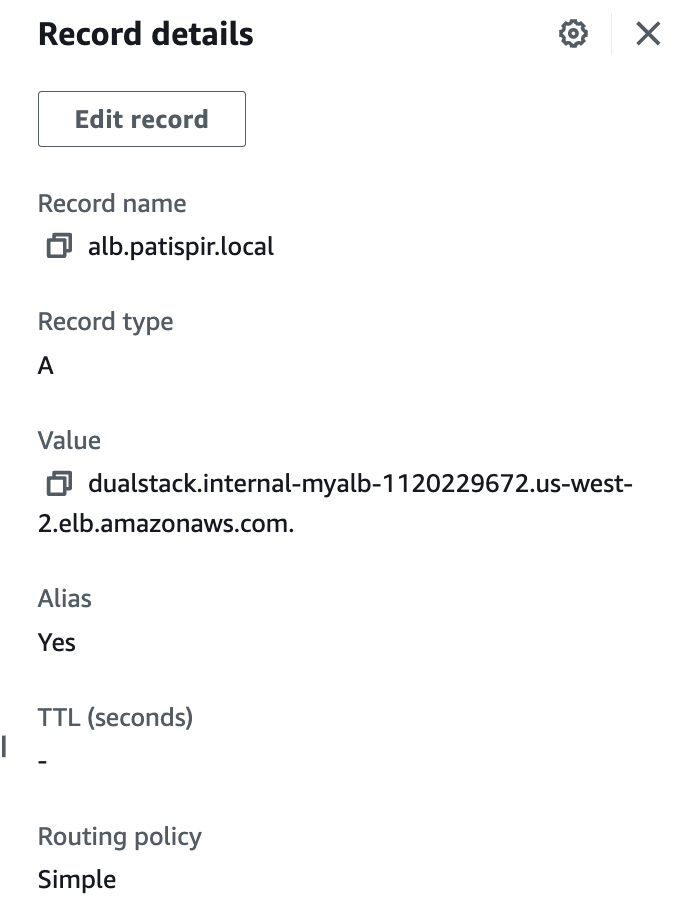

# Connect application from different EKS Clusters on different accounts by using Internal Ingress with Route53 PrivateDNS

In this project, we will demontrate how can applications which running on difference AWS Account can communicate by using Internal Ingress with Route53 PrivateDNS

## AWS Services
1. [Amazon EKS](https://aws.amazon.com/eks/): 2 EKS Clusters will be running on difference account
2. [VPC Peering](https://docs.aws.amazon.com/vpc/latest/peering/what-is-vpc-peering.html): 2 VPCs will peering together (Non-overlapping CIDR!)
3. [ALB](https://docs.aws.amazon.com/elasticloadbalancing/latest/application/introduction.html): Create Private ALB to distributes incoming traffic to destination pods
4. [Route 53](https://aws.amazon.com/route53/): Private DNS and route to ALB as CNAME records.
5. [AWS Organization](https://docs.aws.amazon.com/organizations/latest/userguide/orgs_introduction.html): Manage and consolidate multiple AWS accounts into an organization (Optional).

---

## AWS Organizations (Optional)

AWS Organizations is an [account](https://docs.aws.amazon.com/organizations/latest/userguide/orgs_getting-started_concepts.html#account) management service that enables you to consolidate multiple AWS accounts into an organization that you create and centrally manage. AWS Organizations includes account management and consolidated billing capabilities that enable you to better meet the budgetary, security, and compliance needs of your business. As an administrator of an organization, you can create accounts in your organization and invite existing accounts to join the organization.

### Create Organization in account A and join Account B to this Organization

---

## EKS Cluster

### Craete EKS Cluster on Account A and B
Follow this [EKS Workshop](https://www.eksworkshop.com/docs/introduction/setup/your-account/) to create cluster in both account. Please make sure 2 VPC are Non-overlapping CIDR!

### Deploy Applications to account A

Follow this [EKS Workshop](https://www.eksworkshop.com/docs/introduction/getting-started/finish) to deploy applications on account A

### Deploy Internal Ingress to account A for UI

```bash
kubectl apply -f ui-private-ingress.yaml
```

### Create busybox application for testing on Account B

Test connecting to internal ingress on account will be failed.

```bash
kubectl run -i --tty load-generator --image=busybox /bin/sh
wget -q -O - http://internal-myalb-1120229672.us-west-2.elb.amazonaws.com
```

---

## VPC Peering

### Create VPC Peering to connect between VPC on account A and VPC B account B

Follow this [Link](https://docs.aws.amazon.com/vpc/latest/peering/working-with-vpc-peering.html) to create VPC peering connections between 2 accounts

On account B inside `busybox`, run `wget` agian. This test will be pass. This pod on Account B can access `ui` application on Account A

```bash
wget -q -O - http://internal-myalb-1120229672.us-west-2.elb.amazonaws.com
```

---

## Route 53

### Create Route 53 Private DNS

On Account A, create Route 53 Private DNS 
- Define Domain name
- Associate to EKS VPC

### Create alias record to ALB



On this point on account A, you will be able to access ui application via private DNS. But you will unable to access this Private DNS on account B. You can test on account B by calling to Private DNS on account A 

```bash
wget -q -O - http://alb.patispir.local
wget: bad address 'alb.patispir.local'
```

### Associate a Route 53 private hosted zone with a VPC on a different AWS account

Follow on this [Link](https://repost.aws/knowledge-center/route53-private-hosted-zone) to  Associate a Route 53 private hosted zone with a VPC on a AWS account B.

#### Account A, list the available hosted zones

```bash
aws route53 list-hosted-zones
{
    "HostedZones": [
        {
            "Id": "/hostedzone/XXXXX313R8VD87UXXXX",
            "Name": "patispir.local.",
            "CallerReference": "bc416ede-7b1e-xxx-xxxxxx-xxxxxxxxx",
            "Config": {
                "Comment": "",
                "PrivateZone": true
            },
            "ResourceRecordSetCount": 3
        }
    ]
}
```

#### Account A, lists the VPCs from other accounts that you can associate with your private hosted zone. (It should be empty)

```bash
aws route53 list-vpc-association-authorizations --hosted-zone-id /hostedzone/XXXXX313R8VD87UXXXX
{
    "VPCs": [],
    "HostedZoneId": "XXXXX313R8VD87UXXXX"
}
```

#### Account A, CreateVPCAssociationAuthorization for Account B 
- VPCId is VPC from Account B
- Hostedzone os hostedzone from Account A

```bash
aws route53 create-vpc-association-authorization --hosted-zone-id /hostedzone/XXXXX313R8VD87UXXXX --vpc VPCRegion=us-west-2,VPCId=vpc-xxxxb4d4c74e7xxxx --region us-west-2
{
    "HostedZoneId": "XXXXX313R8VD87UXXXX",
    "VPC": {
        "VPCRegion": "us-west-2",
        "VPCId": "vpc-xxxxb4d4c74e7xxxx"
    }
}
```

#### Account B, association between the private hosted zone in Account A and the VPC in Account B

```bash
aws route53 associate-vpc-with-hosted-zone --hosted-zone-id /hostedzone/XXXXX313R8VD87UXXXX --vpc VPCRegion=us-west-2,VPCId=vpc-xxxxb4d4c74e7xxxx --region us-west-2
```

#### Account A, Delete the association authorization
```bash
aws route53 delete-vpc-association-authorization --hosted-zone-id /hostedzone/XXXXX313R8VD87UXXXX  --vpc VPCRegion=us-west-2,VPCId=vpc-xxxxb4d4c74e7xxxx --region us-west-2
```

#### Account A, List the association authorization. It should be empty
```bash
aws route53 list-vpc-association-authorizations --hosted-zone-id /hostedzone/XXXXX313R8VD87UXXXX
{
    "VPCs": [],
    "HostedZoneId": "XXXXX313R8VD87UXXXX"
}
```

After this completed this guideline. From Account B, you will be able to access Account A Private DNS.

```bash
wget -q -O - http://alb.patispir.local
<!DOCTYPE html>
<html lang="en">
    <head>
.
.
.
```

---

## References

- [How do I associate a Route 53 private hosted zone with a VPC on a different AWS account?](https://repost.aws/knowledge-center/route53-private-hosted-zone)

---